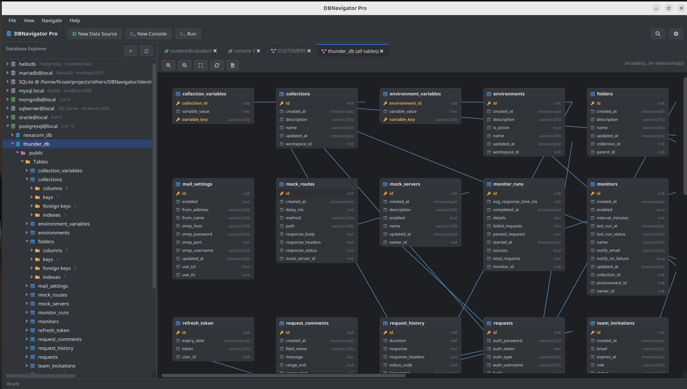

<div align="center">

# DBNavigator Pro

**A DataGrip-style desktop database IDE, built from scratch in JavaFX.**

One unified explorer, console, and data editor for relational databases *and* MongoDB —
PostgreSQL, MySQL, MariaDB, SQL Server, Oracle, SQLite, and MongoDB, all in one app.

</div>

<br>

## 📸 Screenshots

<!--
  Replace these four placeholders with real screenshots once you have them.
  A good set to aim for: (1) the schema explorer + a SQL console side by side,
  (2) the data grid with inline editing / Submit-Revert visible,
  (3) the MongoDB console with autocomplete open,
  (4) a database ER diagram.
-->

<table>
  <tr>
    <td align="center" width="50%">
      <br>
      <sub><b>Schema explorer + SQL console</b></sub>
    </td>
    <td align="center" width="50%">
      <br>
      <sub><b>Data grid — sorting, inline editing, Submit/Revert</b></sub>
    </td>
  </tr>
  <tr>
    <td align="center" width="50%">
      <br>
      <sub><b>MongoDB shell console + autocomplete</b></sub>
    </td>
    <td align="center" width="50%">
      <br>
      <sub><b>Whole-database ER diagram</b></sub>
    </td>
  </tr>
</table>

<br>

## What this is

DBNavigator Pro is a hobby-turned-serious project to build a genuinely useful,
DataGrip-style database client — not a toy demo, but a tool with real query
execution, real schema editing, real data editing, and the day-to-day
conveniences (autocomplete, history, bookmarks, split editors) that make a
database IDE actually pleasant to live in.

It currently supports **six relational engines and MongoDB** through one
consistent interface: the same schema tree, the same tab system, the same
keyboard habits — whether you're writing SQL against Postgres or `db.collection`
shell commands against Mongo.

This is an actively evolving project. The feature list below reflects what's
implemented *today*; the [Roadmap](#-roadmap--whats-next) section is what's
coming, and [Feedback & Suggestions](#-feedback--suggestions) explains how to
influence what gets built next.

<br>

## ✅ Current features

### Connections & schema explorer
- One lazy-loading tree for every connection: databases → schemas → tables /
  views / procedures / functions / sequences (SQL), or databases →
  collections (MongoDB) — nothing loads until you expand it.
- Table nodes show **columns** (exact types like `numeric(19,4)`,
  `varchar(255)`, `timestamp(6)` — not just the bare type name), **keys**,
  **foreign keys**, **indexes**, and **partitions** — each folder only
  appears when the table actually has one.
- MongoDB collection nodes show **fields** (inferred from sampled documents,
  including flattened nested fields like `address.city`) and **indexes**.
- Right-click almost anything: new console, new database, modify table/
  collection, rename, drop (with a type-the-name confirmation for anything
  destructive), refresh, dump/restore, diagrams.
- Session-scoped password prompts — asked once per connection per session,
  never repeatedly, even for servers with no password at all.

### SQL console
- Full syntax highlighting: keywords, types, functions, strings, numbers,
  comments, named parameters, qualified references.
- **Ctrl+Enter / Run executes just the statement under the caret** — shown
  with a precise character-range highlight, not the whole line — and
  statements don't need trailing semicolons if they're separated by
  newlines, the same way most SQL tools work.
- Autocomplete for tables, columns, and aliases (alias-aware — resolves
  `b.column` correctly when `b` is an alias).
- Named parameters (`:param`) with a fill-in dialog.
- Real, complete pagination via a live server-side cursor — not "load
  everything and slice it," so browsing a huge result set doesn't blow up
  memory or freeze the app.
- **Real column sorting** — clicking a column header's sort icon re-queries
  the database with an actual `ORDER BY` (wrapping the original query as a
  subquery when needed), sorting the *whole* result, not just the loaded page.
- Local History (every run is checkpointed; browse and restore earlier
  versions of a console's text).
- Bookmarks — mark a line, jump to it later, see every bookmark across every
  open console in one list.
- Execution plan (`EXPLAIN`) at the click of a button.
- Save Console As a `.sql` file; Open In your file manager or default editor
  once it's saved.

### MongoDB console
- Real shell syntax: `use dbname;` and `db.collection.method(args)`, written
  the way the actual Mongo shell accepts it — unquoted object keys, single
  *or* double quoted strings — not strict JSON.
- Supports `find`, `findOne`, `insertOne`, `insertMany`, `updateOne`,
  `updateMany`, `deleteOne`, `deleteMany`, `countDocuments`, `drop`.
- Same statement-highlighting and single-statement Ctrl+Enter execution as
  the SQL console; scripts don't need semicolons between lines.
- Autocomplete for `db`/`use`, collection names, and collection-level
  methods — auto-inserts `()` with the caret landing inside, ready for
  arguments.
- Paginated, sortable `find()` results with Submit/Revert inline editing,
  exactly like the SQL data grid.

### Data grid (SQL & MongoDB)
- Paged browsing with a free-form filter/`WHERE` and `ORDER BY`/sort.
- Inline cell editing with **Submit / Revert** — edits are staged, not
  written immediately, and Submit batches them into the minimum number of
  real statements (one `UPDATE`/`updateOne` per changed row/document, even
  if several of its fields changed).
- Export to CSV; export to JSON for MongoDB results, preserving nested
  document/array structure instead of flattening it to strings.

### Schema & collection editing
- **Modify Table** — add, rename, or drop columns; change an existing
  column's type (`ALTER COLUMN ... TYPE` / `MODIFY COLUMN`, whichever the
  engine needs); live DDL preview before you run it.
- **Modify Collection** (MongoDB) — rename the collection; list, drop, and
  create indexes for real.
- **Create Database** — engine-appropriate fields (owner/tablespace/template
  for PostgreSQL; character set/collation for MySQL, populated live from the
  server).

### Diagrams
- Single-table ER diagram (the table plus its one-hop foreign-key neighbors).
- Whole-database ER diagram, with PNG export.

### Import / export
- `pg_dump` / `pg_restore` dialogs for PostgreSQL, and `mysqldump` / `mysql`
  dialogs for MySQL/MariaDB — full option sets, live command preview, output
  streamed live.
- CSV/SQL data export and CSV import for tables.

### Tabs & workspace
- A DataGrip-style tab right-click menu: Close (this/other/all/left/right —
  "other"/"all" reach every split pane, not just the current one), Copy
  Path/Reference, **Split Right/Down** and their Move variants (a real,
  arbitrarily-nestable split-pane layout), Open Tab in New Window, Pin Tab,
  Reopen Closed Tab, Rename Tab — all working identically for SQL and
  MongoDB tabs.
- Dark and light themes; adjustable editor font (family, size, Ctrl+scroll
  or Ctrl+/- to zoom).

<br>

## 🧰 Tech stack

| Layer | Choice |
|---|---|
| UI | JavaFX 21 |
| Code editor | [RichTextFX](https://github.com/FXMisc/RichTextFX) |
| Icons | [Ikonli](https://kordamp.org/ikonli/) (FontAwesome 5) |
| Connection pooling | [HikariCP](https://github.com/brettwooldridge/HikariCP) |
| JSON | Jackson |
| Drivers | mysql-connector-j, mariadb-java-client, postgresql (pgjdbc), sqlite-jdbc, mssql-jdbc, ojdbc11, mongodb-driver-sync |
| Build | Maven, Java 21 |

<br>

## 🚀 Getting started

### Prerequisites
- **JDK 21** or later
- **Maven 3.9+**

### Build & run
```bash
git clone https://github.com/firoze-hossain/DBNavigator.git
cd DBNavigator
mvn clean javafx:run
```

Or package a runnable jar:
```bash
mvn clean package
java -jar target/DBNavigatorPro-2.0.0.jar
```

### First connection
1. Click **New Data Source** and pick your database type.
2. Fill in host/port/credentials — the **database name is optional** for
   PostgreSQL, MySQL, MariaDB, and SQL Server; leave it blank to browse
   every database on the server from one connection.
3. **Test Connection**, then **OK**. Expand the connection in the Database
   Explorer to browse its schema.
4. Right-click a database (or the connection itself) → **New Query
   Console** — or for MongoDB, the console opens automatically with shell
   syntax ready to go.

<br>

## 🗺️ Roadmap / what's next

Roughly in priority order — see [Feedback & Suggestions](#-feedback--suggestions)
if you'd like to influence this list:

- [ ] MongoDB aggregation pipeline support in the console (`aggregate()`)
- [ ] `mongodump` / `mongorestore` dialogs, matching the existing
      `pg_dump`/`mysqldump` ones
- [ ] Broader MongoDB shell method coverage (`bulkWrite`, `distinct`, more
      admin/db-level commands)
- [ ] SQL Server / Oracle-specific dump-restore tooling
- [ ] A proper query-results diff/compare view
- [ ] Connection groups/folders in the Database Explorer
- [ ] Keyboard-shortcut customization
- [ ] Autocomplete for stored procedure/function parameters
- [ ] Export/import full connection profile sets (for sharing team setups)

Nothing here is committed to a date — this is a project built and refined
incrementally, a bit at a time, driven largely by real usage and feedback.

<br>

## 💬 Feedback & Suggestions

This project gets better through actual use. If you try it and something
is confusing, missing, or broken:

- **Open an issue** describing what you expected vs. what happened — a
  screenshot goes a long way.
- **Have a feature idea?** Open an issue tagged `enhancement` — even a
  rough description ("it would help if X worked like Y") is useful input
  for prioritizing the roadmap above.
- **Found a bug?** Please include your OS, database engine + version, and
  the exact steps to reproduce it if you can.

Pull requests are welcome too, but even just well-described issues are
genuinely valuable — this project is shaped directly by what people
actually run into while using it.

<br>

## 📄 License

_Add your chosen license here (e.g. MIT, Apache 2.0) — none is currently
specified in this repository._

<br>

## 🙏 Acknowledgements

Built with [JavaFX](https://openjfx.io/), [RichTextFX](https://github.com/FXMisc/RichTextFX),
[Ikonli](https://kordamp.org/ikonli/), and the JDBC/MongoDB driver
maintainers whose work makes a project like this possible at all.

---

<div align="center">
<sub>Inspired by the workflow of JetBrains DataGrip — built independently, for the fun and challenge of it.</sub>
</div>
